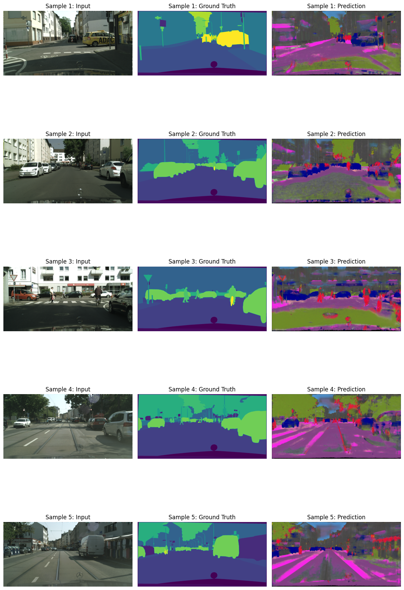
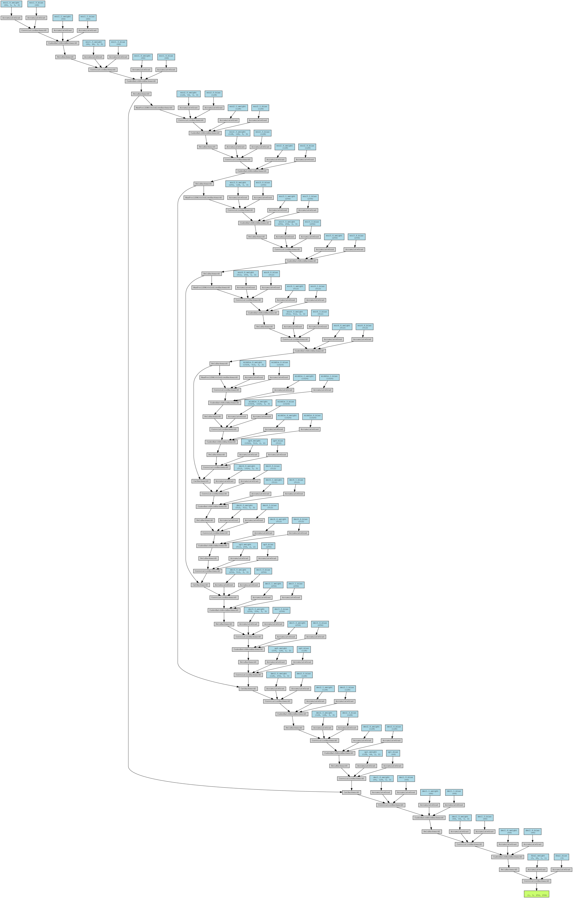

# 🧠 Semantic Segmentation with U-Net on Cityscapes

This repository contains code and assets for training a semantic segmentation model on the [Cityscapes Dataset](https://www.cityscapes-dataset.com/) using a U-Net architecture in PyTorch.

## 📌 Project Overview

Semantic segmentation is the task of assigning a label to every pixel in an image. This project implements a U-Net model to identify urban features like roads, cars, people, and buildings from images of cityscapes.

---

## 🚀 Features

- U-Net architecture with skip connections
- Supports 19 Cityscapes semantic classes
- Training/validation metric tracking: mIoU, Dice, Pixel Accuracy
- CrossEntropy loss with optional class weighting
- Albumentations-based augmentations
- TensorBoard dashboard integration
- Simple CLI-based training and inference

---

## 🧪 Model Performance

| Metric           | Value       |
|------------------|-------------|
| Pixel Accuracy   | 66.7%       |
| Mean IoU (mIoU)  | 0.48        |
| Dice Coefficient | 0.67        |

---

## 🖼️ Inference Example

 

---

## 🛠️ Installation

Two sets of code are provided for use, one in Kaggle Python notebook format and another in script bundle form: 

1. Kaggle python notebook:

```
segmentation.ipynb
```

2. Python file bundle
```bash
git clone https://github.com/yash17897/image-segmentation.git
cd Task-2_Segmentation

# Create virtual environment
python3 -m venv venv
source venv/bin/activate

# Install dependencies
pip install -r requirements.txt
```

---

## 📑 Report

Refer `Report.pdf` for further details.

---

### 🕸️ Model

 
